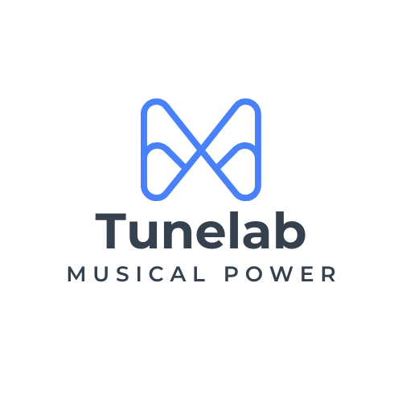

# TuneLab - Collaborative Music Creation Platform

  

A powerful platform enabling musicians to collaborate, create, and share music seamlessly from anywhere in the world.

## 🚀 About TuneLab

TuneLab is a sophisticated web-based platform designed to revolutionize how musicians collaborate. Our suite of professional tools enables real-time collaboration, version control, and comprehensive project management, making remote music production efficient and intuitive.

## 🛠️ Tech Stack

  
  
  
  
  
  
  
  
  
  
  

## ✨ Key Features

- 🎚️ **Advanced DAW Integration** - Real-time collaborative audio workstation with multi-track support
- 🔄 **Intelligent Version Control** - Track changes and manage versions of your audio projects
- 👥 **Team Collaboration Suite** - Tools designed for seamless team workflows and communication
- ☁️ **Cloud Infrastructure** - Secure cloud storage with high-performance audio processing
- 🎵 **Comprehensive Audio Management** - Organize, tag, and search your audio files efficiently
- 📊 **Analytics Dashboard** - Gain insights into your projects and collaboration patterns
- 🔒 **Enterprise-Grade Security** - Protect your intellectual property with our secure platform

## 📈 Project Status

  
  
  
  
  
  
  

## 🌟 Testimonials

> "TuneLab has transformed how our studio collaborates with artists globally. The real-time capabilities are game-changing." - **Grammy-winning Producer**

> "The most intuitive collaboration platform I've used. TuneLab has become essential to our workflow." - **Indie Music Label**

## 🤝 Contributing

We welcome contributions from developers and musicians alike! Whether you're:

- Reporting bugs or issues
- Proposing new features or enhancements
- Submitting pull requests
- Improving documentation

Please read our [Contributing Guidelines](CONTRIBUTING.md) to get started.

## 📝 License

This project is licensed under the MIT License - see the [LICENSE](LICENSE) file for details.

## 📫 Connect With Us

  
  
  
  
  
  
  

---

  Built with ❤️ by the TuneLab Team

